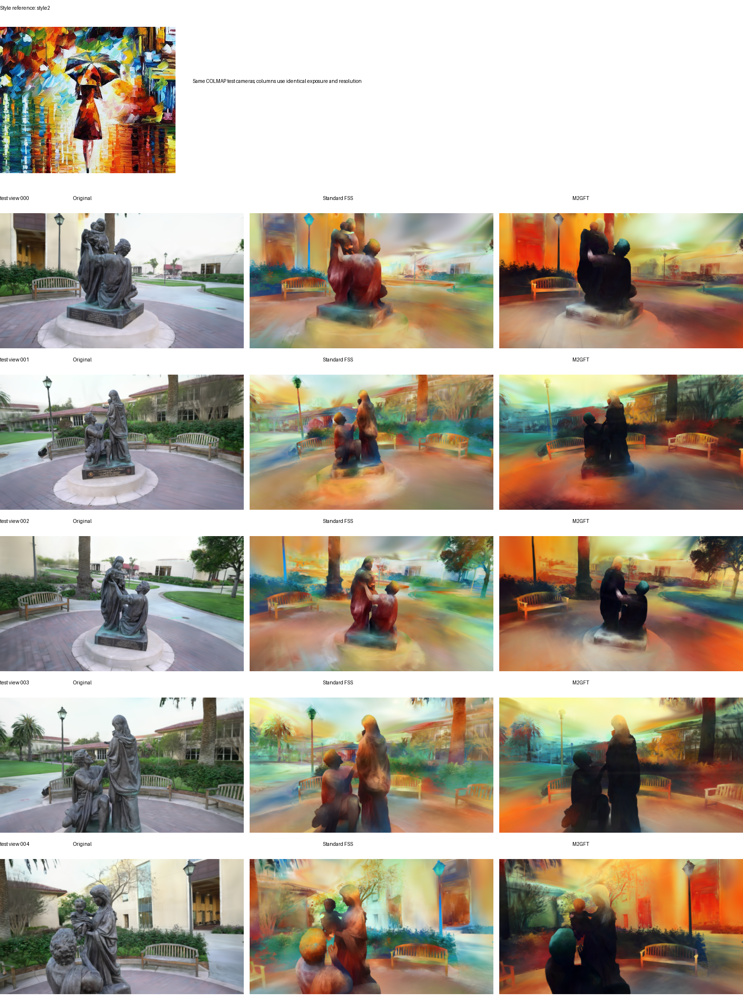

# M2GFT

[English](README.md)

M2GFT 是一个面向 3D Gaussian Splat 的图网络风格化模型。项目来源于
[FastSplatStyler（FSS）](https://github.com/davidmhart/FastSplatStyler)，沿用了其高斯图表示、
SelectionConv 算子和 R41 风格变换路径。

FSS 主要在粗粒度 R41 图特征层完成风格变换。M2GFT 将这条路径扩展为
`r41/r31/r21/r11` 四级图特征金字塔。新增层联合使用自顶向下图特征、AdaIN 统计量、
空间风格 token 和图局部生成模块，最后将变换后的图特征解码为 RGB。

因此，M2GFT 加重的是特征生成主干，而不是在最终图像上追加 refine 模块。训练目标联合使用
多层 Gram/统计量匹配、saliency-guided Patch-SWD、SWD、contextual matching、颜色
sliced-OT 和结构保持损失。

## 结果

下面的每组图片都使用同一张风格参考图和相同的 5 个真实 COLMAP 测试相机，依次展示原场景、
原版 FSS 实现生成的结果和 M2GFT 结果。




在评估的 5 组场景/风格组合中，M2GFT 有 3 组取得更低的 VGG 风格统计误差，并且 5 组的
平均饱和度都高于 FSS。多数情况下它的风格表达更加明显；但在 `train/style99` 和
`truck/style99` 上也更加激进，这两组的 VGG 风格和内容数值由标准 FSS 占优。

全部图片与指标见[完整对比](docs/RESULTS.md)。

## 安装

已验证的环境为 Python 3.10、PyTorch 2.5.1+cu121、PyG 2.7.0 和 gsplat 1.5.3，
建议使用支持 CUDA 的 NVIDIA GPU。

```bash
conda create -n m2gft python=3.10 -y
conda activate m2gft

python -m pip install torch==2.5.1 --index-url https://download.pytorch.org/whl/cu121
python -m pip install torch-scatter==2.1.2 torch-cluster==1.6.3 \
  -f https://data.pyg.org/whl/torch-2.5.1+cu121.html
python -m pip install -r requirements.txt
```

gsplat 会在第一次使用时编译 CUDA 代码。如果当前环境已经包含 `nvcc` 和 CUDA runtime，
但 gsplat 无法找到它们，可以建立项目内的 CUDA toolkit 软链接：

```bash
python setup_cuda.py
```

## 致谢

M2GFT 来源于并扩展了
[FastSplatStyler](https://github.com/davidmhart/FastSplatStyler)。感谢原作者公开图网络高斯
风格化流程和 SelectionConv 实现。本项目也使用了
[Interpolated SelectionConv](https://github.com/davidmhart/interpolated-selectionconv) 和
[LinearStyleTransfer](https://github.com/sunshineatnoon/LinearStyleTransfer) 的思想及改编组件。

第三方组件与许可证详情见 [THIRD_PARTY_NOTICES.md](THIRD_PARTY_NOTICES.md) 和
`third_party/`。本仓库源代码使用 [MIT License](LICENSE)。
