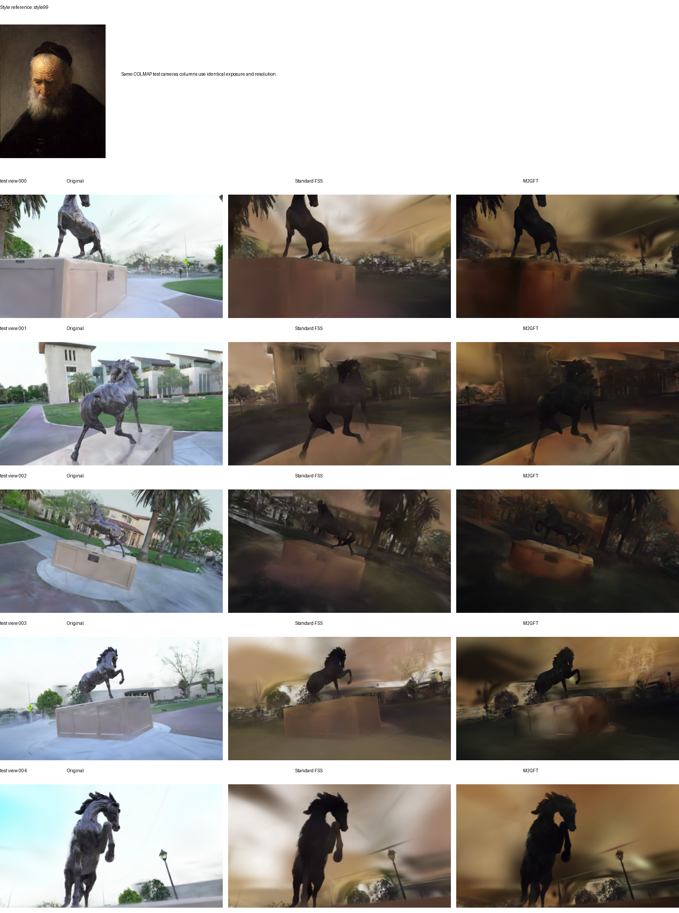
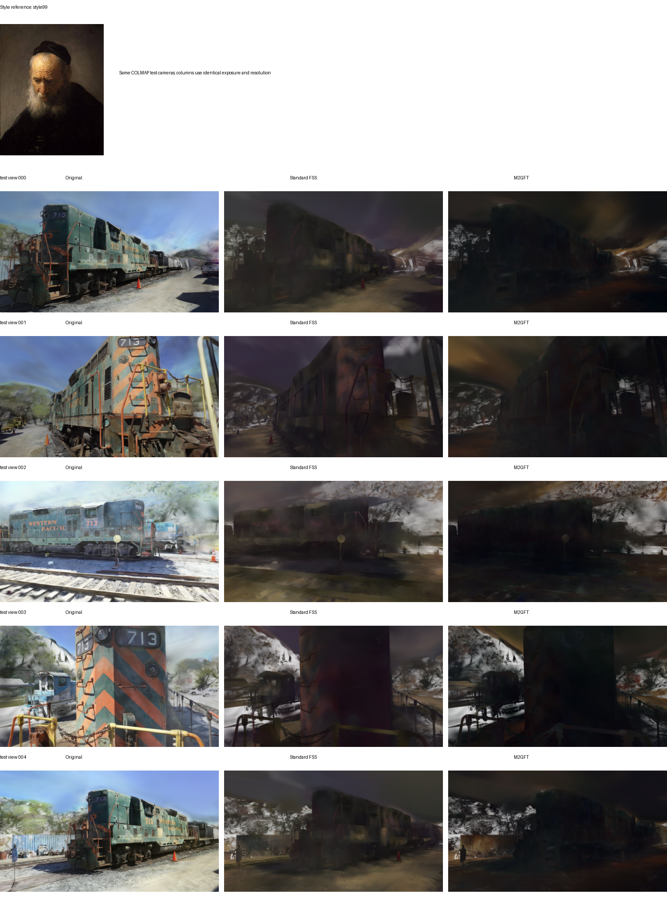
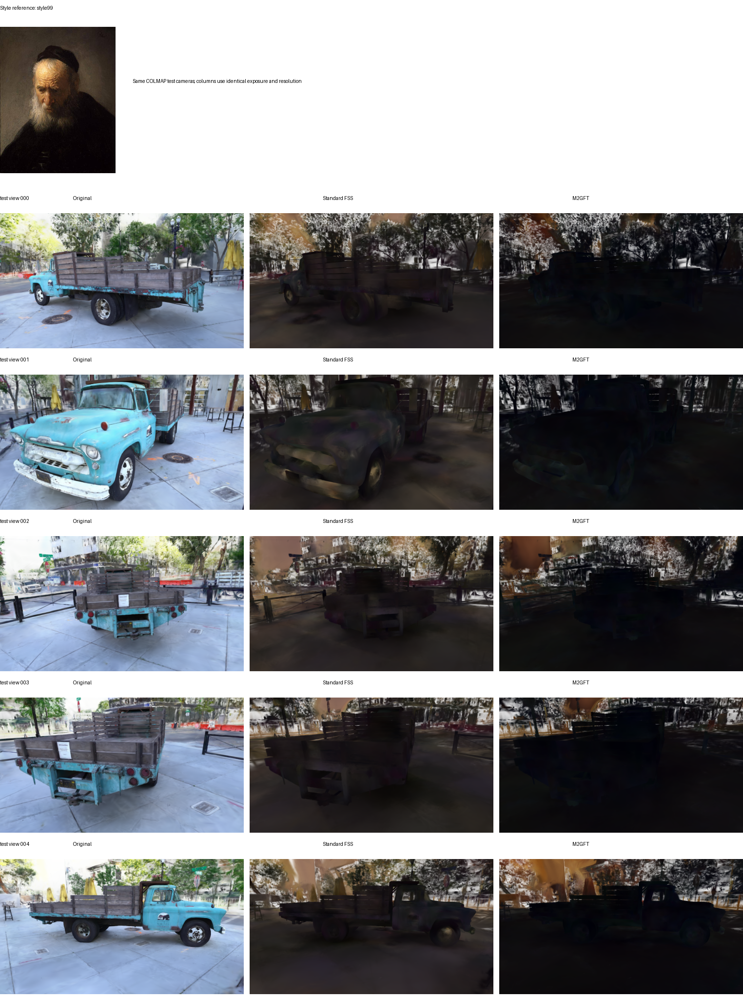

# Standard FSS and M2GFT comparison

These comparisons were generated on 2026-08-16. Each row uses the same scene, style
reference, five real COLMAP test cameras, exposure, and output resolution. The FSS
column is rendered from a `.splat` produced by the original FastSplatStyler
implementation; it is not an internal M2GFT ablation.

## Summary metrics

Lower VGG Gram, style-stat, and content errors are better. Saturation and local
gradient are appearance descriptors rather than universal quality scores.

| Scene / style | Method | Gram ↓ | Style stat ↓ | Content ↓ | Saturation | Local gradient |
|---|---|---:|---:|---:|---:|---:|
| family / style2 | Standard FSS | 0.069994 | 5.535926 | **1.607266** | 0.38366 | **0.01259** |
|  | M2GFT | **0.063547** | **5.116693** | 1.662455 | **0.45580** | 0.01005 |
| horse / style99 | Standard FSS | 0.012708 | 1.764269 | **1.255098** | 0.27562 | **0.00662** |
|  | M2GFT | **0.006687** | **0.971789** | 1.377511 | **0.37578** | 0.00492 |
| train / style99 | Standard FSS | **0.009406** | **1.318869** | **1.491214** | 0.19445 | **0.00699** |
|  | M2GFT | 0.010091 | 1.437157 | 1.660534 | **0.22629** | 0.00636 |
| truck / style1 | Standard FSS | 0.120872 | 8.813707 | **1.575376** | 0.11690 | 0.01417 |
|  | M2GFT | **0.115048** | **7.819579** | 1.610296 | **0.20482** | **0.01619** |
| truck / style99 | Standard FSS | **0.016705** | **2.411148** | **1.601254** | 0.19183 | **0.01492** |
|  | M2GFT | 0.022339 | 2.724215 | 1.851215 | **0.29128** | 0.01368 |

M2GFT improves the VGG Gram and style-stat errors on `family/style2`,
`horse/style99`, and the held-out `truck/style1` case. Its mean saturation is higher
in all five comparisons, matching the visibly stronger color transfer. The trade-off
is that `train/style99` and `truck/style99` become darker and more aggressive, and
standard FSS scores better there. M2GFT also does not win every content or local-edge
metric. These examples are retained to show both the improvement and the limitation.

## Contact sheets

### Truck / style1

Held-out scene and held-out style.

### Family / style2

### Horse / style99

Held-out scene and held-out style.

### Train / style99

### Truck / style99

Held-out scene and held-out style.

Machine-readable summaries are stored next to these images as `*_metrics.json`.
Per-view renders, graph caches, datasets, and exported splats are intentionally not
included in the repository.
