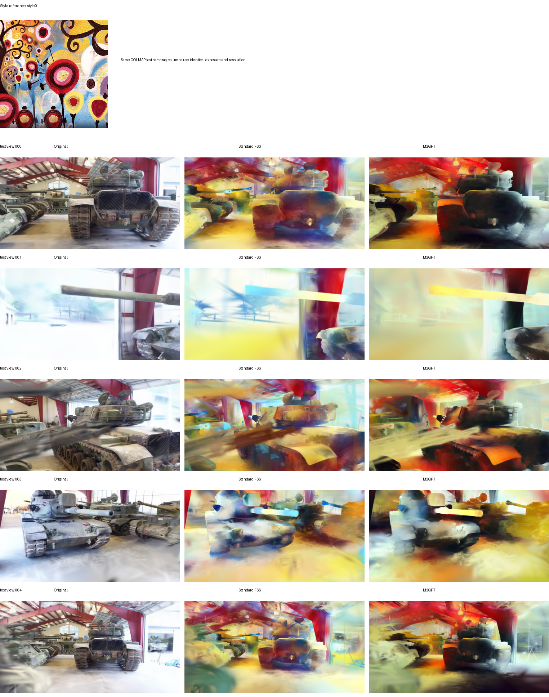
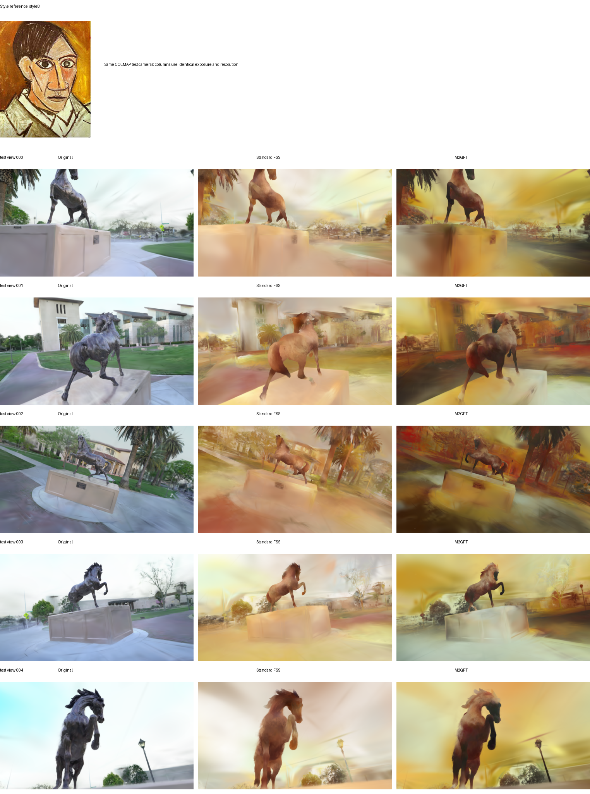

# Selected FSS and M2GFT comparisons

Each comparison uses the same bright style reference, real COLMAP test cameras,
exposure, and output resolution. The FSS column is rendered from a `.splat` produced
by the original FastSplatStyler implementation rather than an internal M2GFT
ablation.

These examples were selected because M2GFT expresses the reference palette and its
spatial contrast more clearly. Standard FSS often produces a softer, more averaged
appearance, whereas M2GFT introduces stronger local color relationships without an
image-space refinement stage.

## Truck / style1

The stained-glass reference contains bright red, blue, gold, and pale regions. M2GFT
transfers these colors into more distinct local regions, while the standard FSS result
is comparatively washed out.

## M60 / style0

M2GFT carries the reference's red, yellow, blue, and dark contrast into the tank and
museum environment more strongly; standard FSS blends these colors into a paler
appearance.

## Horse / style8

The orange and ochre reference is expressed with clearer golden lighting, red-brown
accents, and dark contours in M2GFT. The standard FSS result remains lighter and more
uniform.

